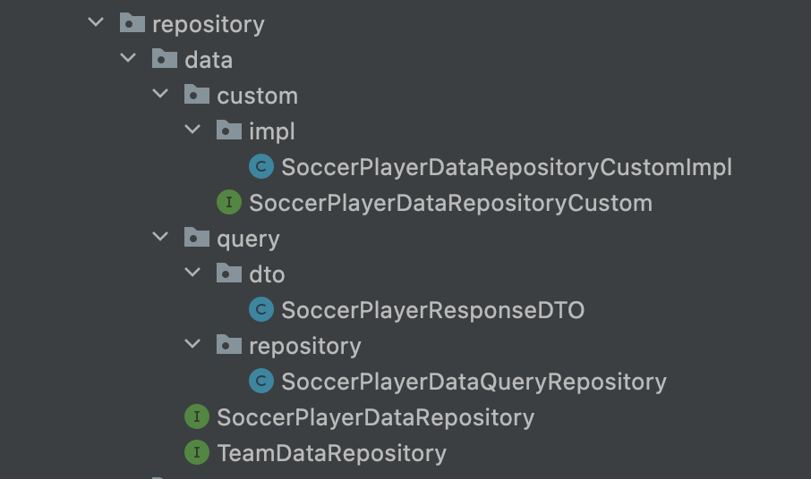
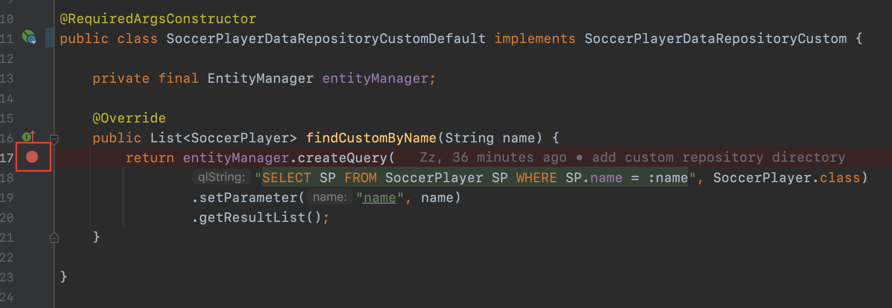

이번 장에서는 사용자 정의 리포지토리에 대해서 알아본다.
글의 하단부에 참고한 강의와 공식문서의 경로를 첨부하였으므로 자세한 사항은 강의나 공식문서에서 확인한다.
모든 코드는 [깃허브 (링크)](https://github.com/roy-zz/data-jpa)에 있다.

---

Spring Data JPA 리포지토리는 인터페이스만 정의하고 구현체는 Spring이 생성해준다.
만약 우리가 인터페이스를 구현하려 한다면 구현해야 하는 기능이 많다.
예를 들어 findAll()과 같이 Data JPA에서 기본으로 제공하는 메소드 또한 직접 구현을 해주어야한다.

만약 여러가지 이유 때문에 인터페이스의 일부분만 직접 구현하고 싶은 경우에 어떻게 해야하는지 알아보도록 한다.
다양한 이유가 있겠지만 필자가 참고한 강의에서 예를 들은 것과 필자의 경험에 의하면 아래 정도의 예시가 있을 듯하다.

- EntityManager를 직접 사용하고 싶은 경우
- 스프링 JDBC Template를 직접 사용하는 경우
- MyBatis로 구축되어 있는 서비스를 점진적으로 JPA로 변경해나가는 경우
- 작업 시간이 오래 걸리는 쿼리를 위해 기본적으로 사용되는 Connection Pool이 아니라 특정 Connection Pool에서 꺼내와서 사용하는 경우
- Querydsl을 사용하는 경우

---

### 사용법

사용자 정의 리포지토리를 위한 사용자 정의 인터페이스를 정의한다.

**SoccerPlayerDataRepositoryCustom**

```java
public interface SoccerPlayerDataRepositoryCustom {
    List<SoccerPlayer> findCustomByName(String name);
}
```

사용자 정의 인터페이스의 구현체를 생성한다.

**SoccerPlayerDataRepositoryCustomImpl**

```java
@RequiredArgsConstructor
public class SoccerPlayerDataRepositoryCustomImpl implements SoccerPlayerDataRepositoryCustom {

    private final EntityManager entityManager;

    @Override
    public List<SoccerPlayer> findCustomByName(String name) {
        return entityManager.createQuery(
                "SELECT SP FROM SoccerPlayer SP WHERE SP.name = :name", SoccerPlayer.class)
                .setParameter("name", name)
                .getResultList();
    }
}
```

Data JPA를 위한 인터페이스가 사용자 정의 인터페이스를 상속받도록 한다.

**SoccerPlayerDataRepository**

```java
public interface SoccerPlayerDataRepository extends
        JpaRepository<SoccerPlayer, Long>,
        SoccerPlayerDataRepositoryCustom {
    // 이하 생략
}
```

테스트 코드를 확인해보면 SoccerPlayerDataRepository를 통해서 사용자 정의 리포지토리의 메소드가 호출되는 것을 확인할 수 있다.

**SoccerPlayerDataRepositoryTest**

```java
@Transactional
@SpringBootTest
class SoccerPlayerDataRepositoryTest {
    @PersistenceContext
    private EntityManager entityManager;
    @Autowired
    private SoccerPlayerDataRepository dataRepository;
    @Test
    @DisplayName("사용자 정의 리포지토리 정상 작동 테스트")
    void customRepositoryTest() {
        dataRepository.findCustomByName("Roy");
    }
}
```

---

### 주의 사항

사용자 정의 리포지토리를 사용할 때 주의해야할 점이 두가지 있다.

**명확한 사용 이유**

우선 사용자 정의 리포지토리를 사용하는 이유가 명확해야 한다.
예를 들어 화면에 뿌려지는 내용을 조회하기 위한 복잡한 쿼리를 위한 리포지토리(이하 A 리포지토리)가 있고 
비즈니스 로직을 위한 리포지토리(이하 B 리포지토리)가 있다고 가정해본다.
아마 B 리포지토리는 JpaRepository를 상속받고 있어서 기본적은 기능을 제공하고 있을 것이다.
만약 A 리포지토리를 사용자 정의 리포지토로 생성하고 B 리포지토리가 A 리포지토리를 상속받으면 어떠한 상황이 발생하는지 생각해본다.

우선 A 리포지토리, B 리포지토리는 두 개의 클래스 파일로 분리되어있다. 
하지만 A 리포지토리에 접근하기 위해서는 B 리포지토리를 통해 접근해야한다. 이는 완벽한 분리라고 볼 수 없다.

이러한 경우 A 리포지토리, B 리포지토리 따로 Bean으로 등록되도록 설계하여 필요한 곳에 독립적으로 사용되도록 해야한다.

필자가 만든 리포지토리 구조를 살펴보자.



custom 디렉토리에 사용자 정의 인터페이스인 **SoccerPlayerDataRepositoryCustom**이 위치한다.
이를 구현하는 구현체인 **SoccerPlayerDataRepositoryCustomImpl**은 custom의 하위 디렉토리인 impl에 위치한다.

**SoccerPlayerDataRepository**는 JpaRepository를 상속받고 있으며 사용자 정의 인터페이스인 **SoccerPlayerDataRepositoryCustom**을 상속받고 있다.

화면에 뿌려지는 복잡한 쿼리를 위한 리포지토리인 **SoccerPlayerDataQueryRepository**는 query 디렉토리에 위치하고 있다.
여기서 **SoccerPlayerResponseDTO**는 화면에 뿌려지는 데이터를 위한 DTO다.

이러한 구조로 설계를 하면 비즈니스 로직 + 사용자 정의 메서드를 구현하고 있는 리포지토리 하나와
화면에 뿌려지는 데이터를 위해 복잡한 쿼리를 구현하는 복잡한 리포지토리 하나, 이렇게 두 개의 리포지토리를 독립적으로 사용할 수 있게 된다.

다시 한 번 정리하면 사용자 정의 리포지토리는 **정확히 필요한 시점에 사용해야 한다**는 점이다.

**명명 규칙**

사용자 정의 리포지토리들은 JPA가 정해놓은 명명 규칙을 따라야한다.

- 2.x 이전 버전: JpaRepository를 상속받고 있는 리포지토리의 이름 + Impl
- 2.x 이후 버전: JpaRepository를 상속하고 있는 리포지토리의 이름 + Impl, 사용자 정의 인터페이스의 이름 + Impl

만약 Impl 대신 Default를 사용하고 싶다면 Spring에서 Default가 붙은 클래스들을 Bean으로 등록할 수 있도록 설정해 주어야한다.

```java
@SpringBootApplication
@EnableJpaRepositories(
        basePackages = "com.roy.datajpa",
        repositoryImplementationPostfix = "Default")
public class DataJpaApplication {

    public static void main(String[] args) {
        SpringApplication.run(DataJpaApplication.class, args);
    }

}
```

개발자가 많은 회사에서는 가급적 기본 규칙을 수정하지 않는 것이 좋다.

**번외**

명명 규칙을 지키지 않고 어떠한 오류가 발생하는지 테스트를 진행하였다.
하지만 필자의 예상과는 다르게 **오류가 발생하지 않았다.**

확인을 위하여 사용자 정의 리포지토리의 구현체에 아래와 같이 Break를 걸어두고 테스트를 진행해보았다.



명명 규칙을 지킨 경우 Break 지점에 걸렸지만 명명 규칙을 지키지 않은 경우 Break 지점에 걸리지 않았다.
아마 명명 규칙을 지키지 않은 경우 JPA에서 어떠한 행위를 하는 듯 한데 이 부분은 아직 명확하게 파악되지 않았다.

혹시라도 필자와 같은 방식으로 테스트를 진행해보고 오류가 발생하지 않는 다는 이유로 "명명 규칙 지키지 않아도 되네" 라고 생각하지 말고
직접 사용자 정의 리포지토리 구현체에 Break 포인트를 걸어두고 해당 구현체를 통해 조회하는 것이 맞는지 확인해보도록 한다.

---

참고한 강의:

- https://www.inflearn.com/course/%EC%8A%A4%ED%94%84%EB%A7%81-%EB%8D%B0%EC%9D%B4%ED%84%B0-JPA-%EC%8B%A4%EC%A0%84
- https://www.inflearn.com/course/%EC%8A%A4%ED%94%84%EB%A7%81%EB%B6%80%ED%8A%B8-JPA-API%EA%B0%9C%EB%B0%9C-%EC%84%B1%EB%8A%A5%EC%B5%9C%EC%A0%81%ED%99%94
- https://www.inflearn.com/course/%EC%8A%A4%ED%94%84%EB%A7%81%EB%B6%80%ED%8A%B8-JPA-%ED%99%9C%EC%9A%A9-1
- https://www.inflearn.com/course/ORM-JPA-Basic

JPA 공식 문서:

- https://docs.spring.io/spring-data/jpa/docs/current/reference/html/#reference

위키백과:

- https://ko.wikipedia.org/wiki/%EC%9E%90%EB%B0%94_%ED%8D%BC%EC%8B%9C%EC%8A%A4%ED%84%B4%EC%8A%A4_API