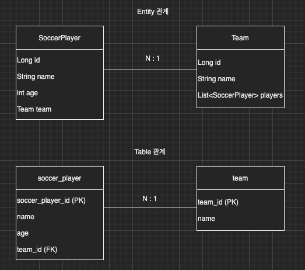
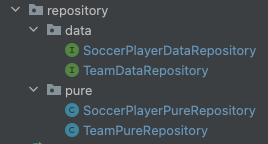

이번 장에서는 Spring Data JPA의 기능을 살펴보기 전에 무엇인지 간략하게 알아보도록 한다.
글의 하단부에 참고한 강의와 공식문서의 경로를 첨부하였으므로 자세한 사항은 강의나 공식문서에서 확인한다.

---

스프링 부트와 일반 JPA를 사용하면서 개발 생산성을 많이 높여왔다.
하지만 여기에 스프링 데이터 JPA까지 사용하게 되면 더욱 개발 생산성이 높아진다.

이번 장에서는 축구선수(SoccerPlayer)와 선수들이 속해있는 팀(Team)을 가지고 예를 들어본다.



**SoccerPlayer**

```java
@Entity
@Getter @Setter
@ToString(of = {"id", "name", "age"})
@NoArgsConstructor(access = PROTECTED)
public class SoccerPlayer {

    @Id @GeneratedValue
    @Column(name = "soccer_player_id")
    private Long id;
    private String name;
    private int age;

    @ManyToOne(fetch = FetchType.LAZY)
    @JoinColumn(name = "team_id")
    private Team team;

    public SoccerPlayer(String name) {
        this(name, 0);
    }

    public SoccerPlayer(String name, int age) {
        this(name, age, null);
    }

    public SoccerPlayer(String name, int age, Team team) {
        this.name = name;
        this.age = age;
        if (Objects.nonNull(team)) {
            changeTeam(team);
        }
    }

    public void changeTeam(Team team) {
        this.team = team;
        team.getSoccerPlayers().add(this);
    }

}
```

**Team**

```java
@Entity
@Getter @Setter
@ToString(of = {"id", "name"})
@NoArgsConstructor(access = PROTECTED)
public class Team {

    @Id @GeneratedValue
    @Column(name = "team_id")
    private Long id;
    private String name;

    @OneToMany(mappedBy = "team")
    private List<SoccerPlayer> soccerPlayers = new ArrayList<>();

    public Team(String name) {
        this.name = name;
    }

}
```

---

### 리포지토리

지금부터 순수 JPA 기반의 리포지토리와 Spring Data JPA 기반의 리포지토리(이하 Data 리포지토리)의 차이를 알아볼 것이다.
총 네 개의 리포지토리를 알아볼 것이며 구조는 아래와 같다.



각각 대칭되는 리포지토리는 아래와 같으며 동일한 기능이 구현되어 있다.

| 구분    | 순수 JPA                      | Spring Data JPA            |
|-------|-----------------------------|----------------------------|
| 축구 선수 | SoccerPlayerPureRepository  | SoccerPlayerDataRepository |
| 팀     | TeamPureRepository          | TeamDataRepository         |

---

순수 JPA 기반의 SoccerPlayerPureRepository와 TeamPureRepository는 아래와 같다.

**SoccerPlayerPureRepository**

```java
@Repository
public class SoccerPlayerPureRepository {
    @PersistenceContext
    private EntityManager entityManager;

    public SoccerPlayer save(SoccerPlayer soccerPlayer) {
        entityManager.persist(soccerPlayer);
        return soccerPlayer;
    }

    public List<SoccerPlayer> saveAll(List<SoccerPlayer> soccerPlayers) {
        List<SoccerPlayer> answer = new ArrayList<>();
        soccerPlayers.forEach(soccerPlayer -> answer.add(save(soccerPlayer)));
        return answer;
    }

    public void delete(SoccerPlayer soccerPlayer) {
        entityManager.remove(soccerPlayer);
    }

    public void deleteAll(List<SoccerPlayer> soccerPlayers) {
        soccerPlayers.forEach(this::delete);
    }

    public List<SoccerPlayer> findAll() {
        return entityManager.createQuery(
                "SELECT SC FROM SoccerPlayer SC", SoccerPlayer.class)
                .getResultList();
    }

    public Optional<SoccerPlayer> findOptionalById(Long id) {
        return Optional.ofNullable(findEntityById(id));
    }

    public SoccerPlayer findEntityById(Long id) {
        return  entityManager.find(SoccerPlayer.class, id);
    }

    public long count() {
        return entityManager.createQuery("SELECT COUNT(SC) FROM SoccerPlayer SC", Long.class)
                .getSingleResult();
    }

}
```

---

**TeamPureRepository**

```java
@Repository
public class TeamPureRepository {
    @PersistenceContext
    private EntityManager entityManager;

    public Team save(Team team) {
        entityManager.persist(team);
        return team;
    }

    public List<Team> saveAll(List<Team> teams) {
        List<Team> answer = new ArrayList<>();
        teams.forEach(team -> answer.add(save(team)));
        return answer;
    }

    public void delete(Team team) {
        entityManager.remove(team);
    }

    public void deleteAll(List<Team> teams) {
        teams.forEach(this::delete);
    }

    public List<Team> findAll() {
        return entityManager.createQuery(
                "SELECT T FROM Team T", Team.class)
                .getResultList();
    }

    public Optional<Team> findOptionalById(Long id) {
        return Optional.ofNullable(findEntityById(id));
    }

    public Team findEntityById(Long id) {
        return entityManager.find(Team.class, id);
    }

    public long count() {
        return entityManager.createQuery("SELECT COUNT(T) FROM Team T", Long.class)
                .getSingleResult();
    }

}
```

---

Spring Data JPA 기반의 SoccerPlayerDataRepository, TeamDataRepository는 아래와 같다.

**SoccerPlayerDataRepository**

```java
public interface SoccerPlayerDataRepository extends JpaRepository<SoccerPlayer, Long> {
}
```

---

**TeamDataRepository**

```java
public interface TeamDataRepository extends JpaRepository<Team, Long> {
}
```

여기서 주의 깊게 확인해야하는 부분은 Data 리포지토리의 코드다.
1. @Repository 어노테이션이 없다.
2. JpaRepository를 상속받고 있다.
3. 인터페이스이며 우리는 구현체를 만들지 않았다.

이렇게만 구현을 하여도 순수 JPA 기반의 리포지토리와 동일하게 작동한다.
또한 JpaRepository를 상속받고 있는 리포지토리는 @Repository를 등록하지 않아도 Spring에 의해 Bean으로 등록되어진다.
JPA의 예외 사항도 Spring의 예외로 변환해주기 때문에 예외 상황 처리도 편해진다.
바로 아래에서 같은 기능을 하는 테스트 코드를 작성해보고 어떻게 작동하는지 확인해본다.

---

### 리포지토리 테스트 

테스트 코드를 확인해보면 id로 Entity를 조회하는 findOptionalById, findById 부분을 제외하면 동일하게 작동하는 것을 확인할 수 있다.
findById 부분도 필자가 메소드명만 맞춰준다면 동일하게 작동할 수 있다.
이렇게 Spring Data JPA는 기본적인 CRUD 구현체를 제공하므로 많은 시간을 절약할 수 있다.

**SoccerPlayerPureRepositoryTest**

```java
@Transactional
@SpringBootTest
class SoccerPlayerPureRepositoryTest {

    @Autowired
    private SoccerPlayerPureRepository pureRepository;

    @Test
    @DisplayName("축구선수 저장 및 조회 테스트")
    void saveAndFindTest() {
        SoccerPlayer soccerPlayer = new SoccerPlayer("Roy");
        SoccerPlayer storedSoccerPlayer = pureRepository.save(soccerPlayer);
        SoccerPlayer foundSoccerPlayer = pureRepository.findOptionalById(storedSoccerPlayer.getId()).orElseThrow();
        assertEquals(foundSoccerPlayer.getId(), storedSoccerPlayer.getId());
        assertEquals(foundSoccerPlayer.getName(), storedSoccerPlayer.getName());
        // JPA Entity 동일성 보장
        assertEquals(foundSoccerPlayer, storedSoccerPlayer);
    }

    @Test
    @DisplayName("축구선수 CRUD 테스트")
    void crudTest() {
        List<SoccerPlayer> soccerPlayers = List.of(
                new SoccerPlayer("Roy"),
                new SoccerPlayer("Perry")
        );
        pureRepository.saveAll(soccerPlayers);
        SoccerPlayer foundSoccerPlayer1 =
                pureRepository.findOptionalById(soccerPlayers.get(0).getId()).orElseThrow();
        SoccerPlayer foundSoccerPlayer2 =
                pureRepository.findOptionalById(soccerPlayers.get(1).getId()).orElseThrow();

        assertEquals(foundSoccerPlayer1, soccerPlayers.get(0));
        assertEquals(foundSoccerPlayer2, soccerPlayers.get(1));

        List<SoccerPlayer> storedSoccerPlayers = pureRepository.findAll();
        assertEquals(soccerPlayers.size(), storedSoccerPlayers.size());

        long storedCount = pureRepository.count();
        assertEquals(soccerPlayers.size(), storedCount);

        pureRepository.deleteAll(storedSoccerPlayers);

        long deletedCount = pureRepository.count();
        assertEquals(0, deletedCount);

    }

}
```

**SoccerPlayerDataRepositoryTest**

```java
@Transactional
@SpringBootTest
class SoccerPlayerDataRepositoryTest {

    @Autowired
    private SoccerPlayerDataRepository dataRepository;

    @Test
    @DisplayName("축구선수 저장 및 조회 테스트")
    void saveAndFindTest() {
        SoccerPlayer soccerPlayer = new SoccerPlayer("Roy");
        SoccerPlayer storedSoccerPlayer = dataRepository.save(soccerPlayer);
        SoccerPlayer foundSoccerPlayer = dataRepository.findById(storedSoccerPlayer.getId()).orElseThrow();
        assertEquals(foundSoccerPlayer.getId(), storedSoccerPlayer.getId());
        assertEquals(foundSoccerPlayer.getName(), storedSoccerPlayer.getName());
        // JPA Entity 동일성 보장
        assertEquals(foundSoccerPlayer, storedSoccerPlayer);
    }

    @Test
    @DisplayName("축구선수 CRUD 테스트")
    void crudTest() {
        List<SoccerPlayer> soccerPlayers = List.of(
                new SoccerPlayer("Roy"),
                new SoccerPlayer("Perry")
        );
        dataRepository.saveAll(soccerPlayers);
        SoccerPlayer foundSoccerPlayer1 =
                dataRepository.findById(soccerPlayers.get(0).getId()).orElseThrow();
        SoccerPlayer foundSoccerPlayer2 =
                dataRepository.findById(soccerPlayers.get(1).getId()).orElseThrow();

        assertEquals(foundSoccerPlayer1, soccerPlayers.get(0));
        assertEquals(foundSoccerPlayer2, soccerPlayers.get(1));

        List<SoccerPlayer> storedSoccerPlayers = dataRepository.findAll();
        assertEquals(soccerPlayers.size(), storedSoccerPlayers.size());

        long storedCount = dataRepository.count();
        assertEquals(soccerPlayers.size(), storedCount);

        dataRepository.deleteAll(storedSoccerPlayers);

        long deletedCount = dataRepository.count();
        assertEquals(0, deletedCount);

    }

}
```

---

참고한 강의:

- https://www.inflearn.com/course/%EC%8A%A4%ED%94%84%EB%A7%81-%EB%8D%B0%EC%9D%B4%ED%84%B0-JPA-%EC%8B%A4%EC%A0%84
- https://www.inflearn.com/course/%EC%8A%A4%ED%94%84%EB%A7%81%EB%B6%80%ED%8A%B8-JPA-API%EA%B0%9C%EB%B0%9C-%EC%84%B1%EB%8A%A5%EC%B5%9C%EC%A0%81%ED%99%94
- https://www.inflearn.com/course/%EC%8A%A4%ED%94%84%EB%A7%81%EB%B6%80%ED%8A%B8-JPA-%ED%99%9C%EC%9A%A9-1
- https://www.inflearn.com/course/ORM-JPA-Basic

JPA 공식 문서: 

- https://docs.spring.io/spring-data/jpa/docs/current/reference/html/#reference

위키백과: 

- https://ko.wikipedia.org/wiki/%EC%9E%90%EB%B0%94_%ED%8D%BC%EC%8B%9C%EC%8A%A4%ED%84%B4%EC%8A%A4_API