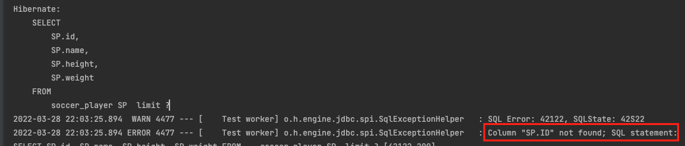

이번 장에서는 네이티브 쿼리에 대해서 알아본다.
글의 하단부에 참고한 강의와 공식문서의 경로를 첨부하였으므로 자세한 사항은 강의나 공식문서에서 확인한다.
모든 코드는 [깃허브 (링크)](https://github.com/roy-zz/data-jpa)에 있다.

---

Spring Data JPA는 DB에 직접 쿼리를 날리는 것 처럼 네이티브 쿼리를 지원한다.
네이티브 쿼리를 사용하게 되면 추후 DB의 종류가 변경되면 코드의 변경도 피할 수 없다.
JPA의 큰 장점인 DB 추상화가 사라지는 것이다.
이러한 이유로 가급적 네이티브 쿼리는 사용하지 않는 것이 좋다.

기존에는 네이티브 쿼리의 반환 타입으로 Object[]와 Tuple만 가능했지만 최근에는 Projections까지 활용 가능해졌다.
네이티브 쿼리의 경우 페이징을 지원한다. 
하지만 Sort를 통한 정렬이 정상 작동하지 않을 수 있으므로 직접 만들어야한다.
네이티브 쿼리는 순수한 문자열이기 때문에 DB에 쿼리를 날려서 정상적으로 결과를 받거나 SQL Exception이 발생하기 전까지는 
문법이 제대로 작성되었는지 확인할 수 없다. 또한 동적 쿼리가 불가능하다.

---

### Sort 오류 해결

아마 클라이언트에 DTO를 뿌리면 클라이언트에서는 자신이 받은 Key 값으로 Sort 요청을 할 것이다.
하지만 네이티브 쿼리의 경우 Sort 부분에서 오류가 많이 발생하여 직접 해결해야하는 경우가 많이 발생한다.

바로 아래와 같은 부분이다.
존재하지 않는 컬럼인 ID를 찾으면서 발생한 오류이다.



네이티브 쿼리를 사용하는 경우 Sort 기준을 쿼리에 작성한 Alias에 맞게 정확히 지정해야 하는데
아래와 같이 단순히 id값으로 오더라도 중간에서 한번 변환하여 Sort를 할 수 있다.

```java
Sort sort = Sort.by(Collections.emptyList());

for (Sort.Order order : pageable.getSort()) {
    switch (order.getProperty()) {
        case "id":
        case "ID":
            sort = sort.and(JpaSort.unsafe(order.getDirection(), "SP.id"));
            break;
        case "soccerPlayerName":
        case "playerName": 
            sort = sort.and(JpaSort.unsafe(order.getDirection(), "SP.name"));
            break;
        default:
            sort = sort.and(Sort.by(order.getDirection(), order.getProperty()));
            break;
    }
}
```

---

### 반환 타입이 Projection인 네이티브 쿼리

**Interface**

```java
public interface NativeProjectionInterface {
    Long getId();
    String getName();
    int getHeight();
    int getWeight();
}
```

```java
public interface SoccerPlayerDataRepository extends
        JpaRepository<SoccerPlayer, Long>,
        SoccerPlayerDataRepositoryCustom,
        JpaSpecificationExecutor<SoccerPlayer> {
    @Query(value =
            "SELECT " +
            "   SP.soccer_player_id as id, " +
            "   SP.name as name, " +
            "   SP.height as height, " +
            "   SP.weight as weight " +
            "FROM " +
            "   soccer_player SP "
            , nativeQuery = true)
    Page<NativeProjectionInterface> findUsingNativeProjectionInterface(Pageable pageable);
}
```

테스트 코드는 아래와 같다.

```java
@Transactional
@SpringBootTest
class SoccerPlayerDataRepositoryTest {

    @PersistenceContext
    private EntityManager entityManager;

    @Autowired
    private SoccerPlayerDataRepository dataRepository;
    @Test
    @DisplayName("네이티브 쿼리 프로젝션 인터페이스 조회 테스트")
    void nativeQueryProjectionInterfaceTest() {
        List<SoccerPlayer> players = List.of(
                new SoccerPlayer("Roy", 173, 73),
                new SoccerPlayer("Roy", 183, 83),
                new SoccerPlayer("Perry", 180, 80),
                new SoccerPlayer("Dice", 183, 90),
                new SoccerPlayer("Louis", 178, 85)
        );
        dataRepository.saveAll(players);
        entityManager.flush();
        entityManager.clear();

        Sort sort = Sort.by(Sort.Direction.ASC, "soccer_player_id");
        PageRequest pageRequest = PageRequest.of(0, 10, sort);
        Page<NativeProjectionInterface> storedPlayers
                = dataRepository.findUsingNativeProjectionInterface(pageRequest);

        List<NativeProjectionInterface> listOfPlayers = storedPlayers.getContent();
        assertEquals(5, listOfPlayers.size());
        
        listOfPlayers.forEach(player -> {
            System.out.println("player.getId() = " + player.getId());
            System.out.println("player.getName() = " + player.getName());
            System.out.println("player.getHeight() = " + player.getHeight());
            System.out.println("player.getWeight() = " + player.getWeight());
        });
    }
}
```

---

**DTO**

```java
@Getter @Setter
public class NativeProjectionDTO {
    private Long id;
    private String name;
    private int height;
    private int weight;

    public NativeProjectionDTO(Long id, String name, int height, int weight) {
        this.id = id;
        this.name = name;
        this.height = height;
        this.weight = weight;
    }

}
```

```java
public interface SoccerPlayerDataRepository extends
        JpaRepository<SoccerPlayer, Long>,
        SoccerPlayerDataRepositoryCustom,
        JpaSpecificationExecutor<SoccerPlayer> {
    @Query(value =
            "SELECT " +
            "   SP.soccer_player_id as id, " +
            "   SP.name as name, " +
            "   SP.height as height, " +
            "   SP.weight as weight " +
            "FROM " +
            "   soccer_player SP "
        , nativeQuery = true)
    Page<NativeProjectionDTO> findUsingNativeProjectionDTO(Pageable pageable);
}
```

테스트 코드는 아래와 같다.

```java
@Transactional
@SpringBootTest
class SoccerPlayerDataRepositoryTest {

    @PersistenceContext
    private EntityManager entityManager;

    @Autowired
    private SoccerPlayerDataRepository dataRepository;
    @Test
    @DisplayName("네이티브 쿼리 프로젝션 DTO 조회 테스트")
    void nativeQueryProjectionDTOTest() {
        List<SoccerPlayer> players = List.of(
                new SoccerPlayer("Roy", 173, 73),
                new SoccerPlayer("Roy", 183, 83),
                new SoccerPlayer("Perry", 180, 80),
                new SoccerPlayer("Dice", 183, 90),
                new SoccerPlayer("Louis", 178, 85)
        );
        dataRepository.saveAll(players);
        entityManager.flush();
        entityManager.clear();

        Sort sort = Sort.by(Sort.Direction.ASC, "soccer_player_id");
        PageRequest pageRequest = PageRequest.of(0, 10, sort);
        Page<NativeProjectionDTO> storedPlayers
                = dataRepository.findUsingNativeProjectionDTO(pageRequest);

        List<NativeProjectionDTO> listOfPlayers = storedPlayers.getContent();
        assertEquals(5, listOfPlayers.size());

        listOfPlayers.forEach(player -> {
            System.out.println("player.getId() = " + player.getId());
            System.out.println("player.getName() = " + player.getName());
            System.out.println("player.getHeight() = " + player.getHeight());
            System.out.println("player.getWeight() = " + player.getWeight());
        });
    }
}
```
---

참고한 강의:

- https://www.inflearn.com/course/%EC%8A%A4%ED%94%84%EB%A7%81-%EB%8D%B0%EC%9D%B4%ED%84%B0-JPA-%EC%8B%A4%EC%A0%84
- https://www.inflearn.com/course/%EC%8A%A4%ED%94%84%EB%A7%81%EB%B6%80%ED%8A%B8-JPA-API%EA%B0%9C%EB%B0%9C-%EC%84%B1%EB%8A%A5%EC%B5%9C%EC%A0%81%ED%99%94
- https://www.inflearn.com/course/%EC%8A%A4%ED%94%84%EB%A7%81%EB%B6%80%ED%8A%B8-JPA-%ED%99%9C%EC%9A%A9-1
- https://www.inflearn.com/course/ORM-JPA-Basic

JPA 공식 문서:

- https://docs.spring.io/spring-data/jpa/docs/current/reference/html/#reference

위키백과:

- https://ko.wikipedia.org/wiki/%EC%9E%90%EB%B0%94_%ED%8D%BC%EC%8B%9C%EC%8A%A4%ED%84%B4%EC%8A%A4_API