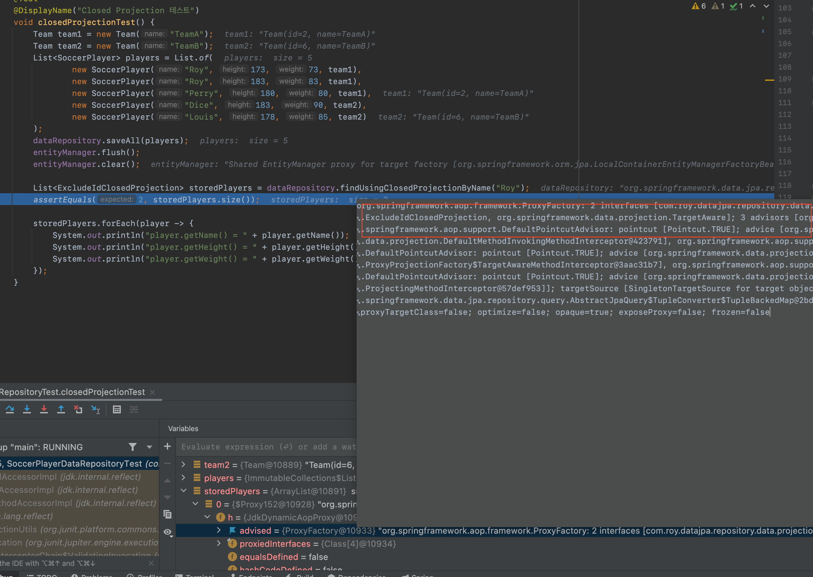

이번 장에서는 Projections에 대해서 알아본다.
글의 하단부에 참고한 강의와 공식문서의 경로를 첨부하였으므로 자세한 사항은 강의나 공식문서에서 확인한다.
모든 코드는 [깃허브 (링크)](https://github.com/roy-zz/data-jpa)에 있다.

---

SQL에서 Select를 할 때 Select 절에 원하는 값을 적는데 이것을 Projection이라 한다.
JPA에서도 이렇게 Entity의 모든 값을 꺼내는 것이 아니라 원하는 값만 꺼낼 수 있도록 Projections를 지원한다.

---

### 인터페이스 기반 Closed Projections

SoccerPlayer 클래스는 아래와 같다.
데이터를 조회할 때 id와 team을 제외한 필드만 조회하는 방법을 알아본다.

```java
@Entity
@NamedQueries(value = {
        @NamedQuery(
                name = "SoccerPlayer.findByName",
                query = "SELECT SP FROM SoccerPlayer SP WHERE SP.name = :name"),
        @NamedQuery(
                name = "SoccerPlayer.findByHeightGreaterThan",
                query = "SELECT SP FROM SoccerPlayer SP WHERE SP.height > :height")
})
@Getter @Setter
@ToString(of = {"id", "name", "height", "weight"})
@NoArgsConstructor(access = PROTECTED)
public class SoccerPlayer {

    @Id @GeneratedValue
    @Column(name = "soccer_player_id")
    private Long id;
    private String name;
    private int height;
    private int weight;

    @ManyToOne(fetch = LAZY, cascade = ALL)
    @JoinColumn(name = "team_id")
    private Team team;
    // 이하 생략
}
```

인터페이스를 생성하고 원하는 get + 원하는 필드명 형식으로 메서드를 정의한다.

```java
public interface ExcludeIdClosedProjection {
    String getName();
    int getHeight();
    int getWeight();
}
```

JpaRepository에 메서드를 정의 할 때 Return 타입을 위에서 생성한 인터페이스로 지정한다.

```java
public interface SoccerPlayerDataRepository extends
        JpaRepository<SoccerPlayer, Long>,
        SoccerPlayerDataRepositoryCustom,
        JpaSpecificationExecutor<SoccerPlayer> {
    List<ExcludeIdClosedProjection> findUsingClosedProjectionByName(String name);
}
```

테스트 코드를 실행시켜 원하는 결과물이 맞는지 확인해본다.

```java
@Transactional
@SpringBootTest
class SoccerPlayerDataRepositoryTest {

    @PersistenceContext
    private EntityManager entityManager;

    @Autowired
    private SoccerPlayerDataRepository dataRepository;
    @Test
    @DisplayName("Closed Projection 테스트")
    void closedProjectionTest() {
        Team team1 = new Team("TeamA");
        Team team2 = new Team("TeamB");
        List<SoccerPlayer> players = List.of(
                new SoccerPlayer("Roy", 173, 73, team1),
                new SoccerPlayer("Roy", 183, 83, team1),
                new SoccerPlayer("Perry", 180, 80, team1),
                new SoccerPlayer("Dice", 183, 90, team2),
                new SoccerPlayer("Louis", 178, 85, team2)
        );
        dataRepository.saveAll(players);
        entityManager.flush();
        entityManager.clear();
        
        List<ExcludeIdClosedProjection> storedPlayers = dataRepository.findUsingClosedProjectionByName("Roy");
        assertEquals(2, storedPlayers.size());
        
        storedPlayers.forEach(player -> {
            System.out.println("player.getName() = " + player.getName());
            System.out.println("player.getHeight() = " + player.getHeight());
            System.out.println("player.getWeight() = " + player.getWeight());
        });
    }
}
```

테스트는 성공할 것이며 발생한 쿼리와 출력 결과는 아래와 같다.

```sql
Hibernate: 
    select
        soccerplay0_.name as col_0_0_,
        soccerplay0_.height as col_1_0_,
        soccerplay0_.weight as col_2_0_ 
    from
        soccer_player soccerplay0_ 
    where
        soccerplay0_.name=?
```

```bash
player.getName() = Roy
player.getHeight() = 173
player.getWeight() = 73
player.getName() = Roy
player.getHeight() = 183
player.getWeight() = 83
```

엔티티의 모든 값이 아닌 우리가 원하는 값만 정확히 가져오는 것을 확인할 수 있다.
즉, Select에 원하는 필드만 조회하는 최적화가 가능하다.

디버거를 사용하여 ExcludeIdClosedProjection을 확인해보면 JPA에서 프록시 객체를 생성하여 사용한 것을 확인할 수 있다.



---

### 인터페이스 기반의 Open Projections

인터페이스를 정의하고 @Value 어노테이션에 SpEL 문법을 사용하여 원하는 형태의 데이터를 만든다.

```java
public interface BodySpecOpenProjection {
    @Value("#{'키:' + target.height + ', 몸무게: ' + target.weight}")
    String getBodySpec();
}
```

리포지토리에 메서드를 생성할 때 return 타입을 위에서 작성한 인터페이스로 한다.

```java
public interface SoccerPlayerDataRepository extends
        JpaRepository<SoccerPlayer, Long>,
        SoccerPlayerDataRepositoryCustom,
        JpaSpecificationExecutor<SoccerPlayer> {
    List<BodySpecOpenProjection> findUsingOpenProjectionByName(String name);
}
```

원하는 결과가 나오는지 테스트 코드를 동작시켜 확인해본다.

```java
@Transactional
@SpringBootTest
class SoccerPlayerDataRepositoryTest {

    @PersistenceContext
    private EntityManager entityManager;

    @Autowired
    private SoccerPlayerDataRepository dataRepository;
    @Test
    @DisplayName("Open Projection 테스트")
    void openProjectionTest() {
        Team team1 = new Team("TeamA");
        Team team2 = new Team("TeamB");
        List<SoccerPlayer> players = List.of(
                new SoccerPlayer("Roy", 173, 73, team1),
                new SoccerPlayer("Roy", 183, 83, team1),
                new SoccerPlayer("Perry", 180, 80, team1),
                new SoccerPlayer("Dice", 183, 90, team2),
                new SoccerPlayer("Louis", 178, 85, team2)
        );
        dataRepository.saveAll(players);
        entityManager.flush();
        entityManager.clear();
        
        List<BodySpecOpenProjection> storedPlayers = dataRepository.findUsingOpenProjectionByName("Roy");
        assertEquals(2, storedPlayers.size());
        
        storedPlayers.forEach(player -> {
            System.out.println("player.getBodySpec() = " + player.getBodySpec());
        });
    }
}
```

테스트는 성공할 것이며 발생한 쿼리와 출력은 아래와 같다.

```sql
Hibernate: 
    select
        soccerplay0_.soccer_player_id as soccer_p1_1_,
        soccerplay0_.height as height2_1_,
        soccerplay0_.name as name3_1_,
        soccerplay0_.team_id as team_id5_1_,
        soccerplay0_.weight as weight4_1_ 
    from
        soccer_player soccerplay0_ 
    where
        soccerplay0_.name=?
```

```bash
player.getBodySpec() = 키:173, 몸무게: 73
player.getBodySpec() = 키:183, 몸무게: 83
```

발생한 쿼리에서 확인되는 것 처럼 필요한 필드만 가져오는 것이 아니라 모든 필드를 가져와서 개발자가 적어놓은 SpEL문법에 맞게 조립한다.
즉, Select에 원하는 필드만 조회하는 최적화는 되지 않는다.

---

### 클래스 기반 Projection

원하는 필드만 가지고 있는 DTO를 생성한다.

```java
@Getter
public class ExcludeIdProjectionDTO {
    private String name;
    private int height;
    private int weight;
    public ExcludeIdProjectionDTO(String name, int height, int weight) {
        this.name = name;
        this.height = height;
        this.weight = weight;
    }
}
```

리포지토리에 원하는 메서드를 생성할 때 return 타입을 위에서 생성한 DTO로 지정한다.

```java
public interface SoccerPlayerDataRepository extends
        JpaRepository<SoccerPlayer, Long>,
        SoccerPlayerDataRepositoryCustom,
        JpaSpecificationExecutor<SoccerPlayer> {
    List<ExcludeIdProjectionDTO> findUsingDtoProjectionByName(String name);
}
```

정상작동 하는지 테스트 코드를 실행시켜서 확인해본다.

```java
@Transactional
@SpringBootTest
class SoccerPlayerDataRepositoryTest {

    @PersistenceContext
    private EntityManager entityManager;

    @Autowired
    private SoccerPlayerDataRepository dataRepository;
    @Test
    @DisplayName("DTO 클래스 기반 Projection 테스트")
    void dtoBaseProjectionTest() {
        Team team1 = new Team("TeamA");
        Team team2 = new Team("TeamB");
        List<SoccerPlayer> players = List.of(
                new SoccerPlayer("Roy", 173, 73, team1),
                new SoccerPlayer("Roy", 183, 83, team1),
                new SoccerPlayer("Perry", 180, 80, team1),
                new SoccerPlayer("Dice", 183, 90, team2),
                new SoccerPlayer("Louis", 178, 85, team2)
        );
        dataRepository.saveAll(players);
        entityManager.flush();
        entityManager.clear();

        List<ExcludeIdProjectionDTO> storedPlayers = dataRepository.findUsingDtoProjectionByName("Roy");
        assertEquals(2, storedPlayers.size());

        storedPlayers.forEach(player -> {
            System.out.println("player.getName() = " + player.getName());
            System.out.println("player.getHeight() = " + player.getHeight());
            System.out.println("player.getWeight() = " + player.getWeight());
        });
    }
}
```

테스트는 성공할 것이며 발생한 쿼리와 출력은 아래와 같다.

```sql
Hibernate: 
    select
        soccerplay0_.name as col_0_0_,
        soccerplay0_.height as col_1_0_,
        soccerplay0_.weight as col_2_0_ 
    from
        soccer_player soccerplay0_ 
    where
        soccerplay0_.name=?
```

```bash
player.getName() = Roy
player.getHeight() = 173
player.getWeight() = 73
player.getName() = Roy
player.getHeight() = 183
player.getWeight() = 83
```

엔티티의 모든 값이 아닌 우리가 원하는 값만 정확히 가져오는 것을 확인할 수 있다.
즉, Select에 원하는 필드만 조회하는 최적화가 가능하다.

---

### 동적 Projection

리포지토리에 메소드를 작성할 때 Generic type을 지정하면 동적으로 사용이 가능하다.

```java
public interface SoccerPlayerDataRepository extends
        JpaRepository<SoccerPlayer, Long>,
        SoccerPlayerDataRepositoryCustom,
        JpaSpecificationExecutor<SoccerPlayer> {
    <T> List<T> findUsingDynamicProjectionByName(String name, Class<T> type);
}
```

테스트 코드를 작동시켜 원하는 결과가 나오는지 확인해본다.

```java
@Transactional
@SpringBootTest
class SoccerPlayerDataRepositoryTest {

    @PersistenceContext
    private EntityManager entityManager;

    @Autowired
    private SoccerPlayerDataRepository dataRepository;
    @Test
    @DisplayName("동적 Projection 테스트")
    void dynamicProjectionTest() {
        Team team1 = new Team("TeamA");
        Team team2 = new Team("TeamB");
        List<SoccerPlayer> players = List.of(
                new SoccerPlayer("Roy", 173, 73, team1),
                new SoccerPlayer("Roy", 183, 83, team1),
                new SoccerPlayer("Perry", 180, 80, team1),
                new SoccerPlayer("Dice", 183, 90, team2),
                new SoccerPlayer("Louis", 178, 85, team2)
        );
        dataRepository.saveAll(players);
        entityManager.flush();
        entityManager.clear();

        List<BodySpecOpenProjection> openProjection
                = dataRepository.findUsingDynamicProjectionByName("Roy", BodySpecOpenProjection.class);
        assertEquals(2, openProjection.size());

        List<ExcludeIdClosedProjection> closedProjection
                = dataRepository.findUsingDynamicProjectionByName("Roy", ExcludeIdClosedProjection.class);
        assertEquals(2, closedProjection.size());

        List<ExcludeIdProjectionDTO> dtoProjection
                = dataRepository.findUsingDynamicProjectionByName("Roy", ExcludeIdProjectionDTO.class);
        assertEquals(2, dtoProjection.size());

    }
}
```

테스트는 성공할 것이며 하나의 메서드로 여러 타입을 조회하는데 성공하였다.

---

### 중첩 구조 처리

원하는 중첩 구조를 가지고 있는 인터페이스를 생성한다.
```java
public interface NestedClosedProjection {
    String getName();
    int getHeight();
    int getWeight();
    TeamInfo getTeam();

    interface TeamInfo {
        String getName();
    }
}
```

바로 위에서 확인한 동적 프로젝션 메서드를 통해서 조회해본다.

```java
@Transactional
@SpringBootTest
class SoccerPlayerDataRepositoryTest {

    @PersistenceContext
    private EntityManager entityManager;

    @Autowired
    private SoccerPlayerDataRepository dataRepository;
    @Test
    @DisplayName("중첩 Projection 테스트")
    void nestedProjectionTest() {
        Team team1 = new Team("TeamA");
        Team team2 = new Team("TeamB");
        List<SoccerPlayer> players = List.of(
                new SoccerPlayer("Roy", 173, 73, team1),
                new SoccerPlayer("Roy", 183, 83, team1),
                new SoccerPlayer("Perry", 180, 80, team1),
                new SoccerPlayer("Dice", 183, 90, team2),
                new SoccerPlayer("Louis", 178, 85, team2)
        );
        dataRepository.saveAll(players);
        entityManager.flush();
        entityManager.clear();

        List<NestedClosedProjection> openProjection
                = dataRepository.findUsingDynamicProjectionByName("Roy", NestedClosedProjection.class);
        assertEquals(2, openProjection.size());
    }
}
```

테스트는 성공할 것이며 발생한 쿼리는 아래와 같다.

```sql
Hibernate: 
    select
        soccerplay0_.name as col_0_0_,
        soccerplay0_.height as col_1_0_,
        soccerplay0_.weight as col_2_0_,
        team1_.team_id as col_3_0_,
        team1_.team_id as team_id1_2_,
        team1_.name as name2_2_ 
    from
        soccer_player soccerplay0_ 
    left outer join
        team team1_ 
            on soccerplay0_.team_id=team1_.team_id 
    where
        soccerplay0_.name=?
```

프로젝션을 통한 중첩 구조 조회는 left outer join만 지원하므로 inner join이 필요한 경우 Where 절을 통해 따로 작업해주어야한다.
root 엔티티의 경우 필요한 필드만 조회하는 Select 최적화가 가능하지만 root 엔티티가 아닌 경우 모든 필드를 가져오기 때문에 Select 최적화가 되지 않는다.

---

참고한 강의:

- https://www.inflearn.com/course/%EC%8A%A4%ED%94%84%EB%A7%81-%EB%8D%B0%EC%9D%B4%ED%84%B0-JPA-%EC%8B%A4%EC%A0%84
- https://www.inflearn.com/course/%EC%8A%A4%ED%94%84%EB%A7%81%EB%B6%80%ED%8A%B8-JPA-API%EA%B0%9C%EB%B0%9C-%EC%84%B1%EB%8A%A5%EC%B5%9C%EC%A0%81%ED%99%94
- https://www.inflearn.com/course/%EC%8A%A4%ED%94%84%EB%A7%81%EB%B6%80%ED%8A%B8-JPA-%ED%99%9C%EC%9A%A9-1
- https://www.inflearn.com/course/ORM-JPA-Basic

JPA 공식 문서:

- https://docs.spring.io/spring-data/jpa/docs/current/reference/html/#reference
- https://docs.spring.io/spring-data/jpa/docs/current/reference/html/#query-by-example

위키백과:

- https://ko.wikipedia.org/wiki/%EC%9E%90%EB%B0%94_%ED%8D%BC%EC%8B%9C%EC%8A%A4%ED%84%B4%EC%8A%A4_API