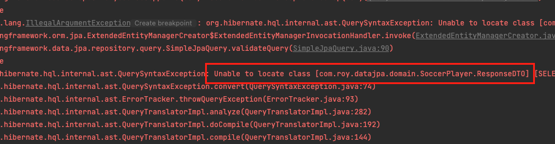

이번 장에서는 @Query 어노테이션을 사용한 조회에 대해서 알아본다.
글의 하단부에 참고한 강의와 공식문서의 경로를 첨부하였으므로 자세한 사항은 강의나 공식문서에서 확인한다.
모든 코드는 [깃허브 (링크)](https://github.com/roy-zz/data-jpa)에 있다.

---

NamedQuery가 Entity에 존재하였다면 @Query를 사용하여 직접 쿼리를 작성하는 방식은 @NamedQuery의 내용이 @Query 어노테이션 안으로 들어온 방식이다.
SoccerPlayer가 가지는 속성은 아래와 같으며 Entity가 아닌 DTO로 조회하기위해 ResponseDTO를 추가하였다.

**SoccerPlayer**

```java
@Entity
@NamedQueries(value = {
        @NamedQuery(
                name = "SoccerPlayer.findByName",
                query = "SELECT SP FROM SoccerPlayer SP WHERE SP.name = :name"),
        @NamedQuery(
                name = "SoccerPlayer.findByHeightGreaterThan",
                query = "SELECT SP FROM SoccerPlayer SP WHERE SP.height > :height")
})
@Getter @Setter
@ToString(of = {"id", "name", "height", "weight"})
@NoArgsConstructor(access = PROTECTED)
public class SoccerPlayer {

    @Id
    @GeneratedValue
    @Column(name = "soccer_player_id")
    private Long id;
    private String name;
    private int height;
    private int weight;

    @ManyToOne(fetch = FetchType.LAZY)
    @JoinColumn(name = "team_id")
    private Team team;

    @Getter
    @AllArgsConstructor
    public static class ResponseDTO {
        private String name;
        private int height;
        private int weight;
    }
    
    // 이하 생략
}
```

**SoccerPlayerDataRepository**
```java
public interface SoccerPlayerDataRepository extends JpaRepository<SoccerPlayer, Long> {
    @Query(value = "SELECT SP FROM SoccerPlayer SP")
    List<SoccerPlayer> findEntityAllUsingQueryAnnotation();

    @Query(value =
            "SELECT new com.roy.datajpa.domain.SoccerPlayer.ResponseDTO " +
            "(SP.name, SP.height, SP.weight) " +
            "FROM SoccerPlayer SP")
    List<SoccerPlayer.ResponseDTO> findDTOAllUsingQueryAnnotation();
}
```

**SoccerPlayerDataRepositoryTest**

```java
@Transactional
@SpringBootTest
class SoccerPlayerDataRepositoryTest {

    @Autowired
    private SoccerPlayerDataRepository dataRepository;
    @Test
    @DisplayName("@Query Entity 조회 테스트")
    void queryAnnotationFindEntityTest() {
        List<SoccerPlayer> players = List.of(
                new SoccerPlayer("Roy", 173),
                new SoccerPlayer("Perry", 183)
        );
        dataRepository.saveAll(players);

        List<SoccerPlayer> result =
                dataRepository.findEntityAllUsingQueryAnnotation();
        assertEquals(2, result.size());
    }

    @Test
    @DisplayName("@Query DTO 조회 테스트")
    void queryAnnotationFindDTOTest() {
        List<SoccerPlayer> players = List.of(
                new SoccerPlayer("Roy", 173),
                new SoccerPlayer("Perry", 183)
        );
        dataRepository.saveAll(players);

        List<SoccerPlayer.ResponseDTO> result =
                dataRepository.findDTOAllUsingQueryAnnotation();
        assertEquals(2, result.size());
        assertEquals(players.get(0).getName(), result.get(0).getName());
        assertEquals(players.get(0).getHeight(), result.get(0).getHeight());
    }
}
```

테스트를 진행해보면 아래와 같은 오류가 발생하며 실패한다.
사실 글을 쓰면서 예상하지 못한 일인데 JPA의 리턴 타입으로 Inner Class를 사용할 수 없다.



원인은 추후에 생각해보고 DTO 클래스를 Entity 밖으로 꺼내서 다시 진행해본다.
수정된 코드들은 아래와 같다.

**Entity & DTO**
```java
@Entity
@NamedQueries(value = {
        @NamedQuery(
                name = "SoccerPlayer.findByName",
                query = "SELECT SP FROM SoccerPlayer SP WHERE SP.name = :name"),
        @NamedQuery(
                name = "SoccerPlayer.findByHeightGreaterThan",
                query = "SELECT SP FROM SoccerPlayer SP WHERE SP.height > :height")
})
@Getter @Setter
@ToString(of = {"id", "name", "height", "weight"})
@NoArgsConstructor(access = PROTECTED)
public class SoccerPlayer {

    @Id
    @GeneratedValue
    @Column(name = "soccer_player_id")
    private Long id;
    private String name;
    private int height;
    private int weight;

    @ManyToOne(fetch = FetchType.LAZY)
    @JoinColumn(name = "team_id")
    private Team team;
}

@Getter
@AllArgsConstructor
public class SoccerPlayerResponseDTO {
    private String name;
    private int height;
    private int weight;
}
```

**Repository**

```java
public interface SoccerPlayerDataRepository extends JpaRepository<SoccerPlayer, Long> {
    @Query(value = "SELECT SP FROM SoccerPlayer SP")
    List<SoccerPlayer> findEntityAllUsingQueryAnnotation();

    @Query(value =
            "SELECT new com.roy.datajpa.repository.data.query.dto.SoccerPlayerResponseDTO " +
            "(SP.name, SP.height, SP.weight) " +
            "FROM SoccerPlayer SP")
    List<SoccerPlayerResponseDTO> findDTOAllUsingQueryAnnotation();
}

```

**Test**

```java
@Transactional
@SpringBootTest
class SoccerPlayerDataRepositoryTest {
    @Test
    @DisplayName("@Query Entity 조회 테스트")
    void queryAnnotationFindEntityTest() {
        List<SoccerPlayer> players = List.of(
                new SoccerPlayer("Roy", 173),
                new SoccerPlayer("Perry", 183)
        );
        dataRepository.saveAll(players);

        List<SoccerPlayer> result =
                dataRepository.findEntityAllUsingQueryAnnotation();
        assertEquals(2, result.size());
    }

    @Test
    @DisplayName("@Query DTO 조회 테스트")
    void queryAnnotationFindDTOTest() {
        List<SoccerPlayer> players = List.of(
                new SoccerPlayer("Roy", 173),
                new SoccerPlayer("Perry", 183)
        );
        dataRepository.saveAll(players);

        List<SoccerPlayerResponseDTO> result =
                dataRepository.findDTOAllUsingQueryAnnotation();
        assertEquals(2, result.size());
        assertEquals(players.get(0).getName(), result.get(0).getName());
        assertEquals(players.get(0).getHeight(), result.get(0).getHeight());
    }
}
```

이번에는 정상적으로 테스트를 통과하는 것을 확인할 수 있다.

---

내부 클래스는 왜 JPA에서 조회하지 못할까.
어디까지나 정답이 아닌 필자의 추측일 뿐이다.

data-mongodb에서는 @Document 어노테이션(jpa의 @Entity)이 붙은 클래스의 내부 클래스에 DTO를 생성하고 조회까지 가능하였다.
그렇다면 data-mongodb와 data-jpa는 어떠한 차이가 있을까?

필자가 생각하는 가장 큰 차이는 영속성 컨텍스트의 존재가 아닐까 싶다.
data-mongodb는 Transaction, 지연 로딩의 개념이 없기 때문에 프록시 객체를 사용하지 않았다.
하지만 data-jpa는 Transaction, 지연 로딩을 위해 프록시를 사용해야하는데 이러한 프록시 기술를 사용하기 위한 클래스로 
내부 클래스는 사용할 수 없는 것 아닐까 라고 조심스럽게 예상해본다. ~~(아직 갈 길이 멀다...)~~

---

참고한 강의:

- https://www.inflearn.com/course/%EC%8A%A4%ED%94%84%EB%A7%81-%EB%8D%B0%EC%9D%B4%ED%84%B0-JPA-%EC%8B%A4%EC%A0%84
- https://www.inflearn.com/course/%EC%8A%A4%ED%94%84%EB%A7%81%EB%B6%80%ED%8A%B8-JPA-API%EA%B0%9C%EB%B0%9C-%EC%84%B1%EB%8A%A5%EC%B5%9C%EC%A0%81%ED%99%94
- https://www.inflearn.com/course/%EC%8A%A4%ED%94%84%EB%A7%81%EB%B6%80%ED%8A%B8-JPA-%ED%99%9C%EC%9A%A9-1
- https://www.inflearn.com/course/ORM-JPA-Basic

JPA 공식 문서:

- https://docs.spring.io/spring-data/jpa/docs/current/reference/html/#reference

위키백과:

- https://ko.wikipedia.org/wiki/%EC%9E%90%EB%B0%94_%ED%8D%BC%EC%8B%9C%EC%8A%A4%ED%84%B4%EC%8A%A4_API