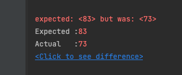

이번 장에서는 벌크성 쿼리에 대해서 알아본다.
글의 하단부에 참고한 강의와 공식문서의 경로를 첨부하였으므로 자세한 사항은 강의나 공식문서에서 확인한다.
모든 코드는 [깃허브 (링크)](https://github.com/roy-zz/data-jpa)에 있다.

---

### 순수 JPA의 벌크성 쿼리

**SoccerPlayerPureRepository**

```java
@Repository
public class SoccerPlayerPureRepository {
    @PersistenceContext
    private EntityManager entityManager;
    public int bulkUpdate(int height) {
        return entityManager.createQuery(
                "UPDATE SoccerPlayer SP SET SP.weight = SP.weight + 10 " +
                        "WHERE SP.height > :height")
                .setParameter("height", height)
                .executeUpdate();
    }
}
```

테스트 코드는 아래와 같다.

```java
@Transactional
@SpringBootTest
class SoccerPlayerPureRepositoryTest {
    @Autowired
    private SoccerPlayerPureRepository pureRepository;
    @Test
    @DisplayName("벌크 업데이트 테스트")
    void bulkUpdateTest() {
        List<SoccerPlayer> players = List.of(
                new SoccerPlayer("Roy", 173, 73),
                new SoccerPlayer("Perry", 180, 80),
                new SoccerPlayer("Sally", 160, 60),
                new SoccerPlayer("Dice", 183, 83),
                new SoccerPlayer("Louis", 178, 78)
        );
        pureRepository.saveAll(players);
        int updatedCount = pureRepository.bulkUpdate(170);
        assertEquals(4, updatedCount);
        SoccerPlayer storedPlayer = pureRepository.findByName("Roy");
        assertEquals(83, storedPlayer.getWeight());
    }
}
```

170이 넘는 선수의 몸무게는 10이 증가했어야한다.
그렇다면 "Roy"의 몸무게는 83으로 증가하였는지 확인하는 코드는 통과할 수 있을까



사진과 같이 실패한다.
JPA의 벌크성 쿼리는 영속성 컨텍스트를 무시하기 때문에 쿼리 전후의 영속성 컨텍스트 내부는 변경사항이 없다.
이 말은 DB와 영속성 컨텍스트의 데이터 싱크가 맞지 않을 수 있다는 의미가 된다.

이러한 문제를 해결하기 위해서는 벌크성 쿼리 이전에 영속성 컨텍스트의 1차 캐시를 지우고
벌크성 쿼리 완료 이후에 DB에 Select를 하여 다시 1차 캐시를 채우도록 유도해야한다.

아래의 코드와 같이 영속성 컨텍스트를 Clear해주고 DB로 부터 다시 데이터를 불러오도록 해야한다.
pureRepository의 clear 메서드는 단순히 EntityManager.clear()를 호출하는 역할을 한다.
```java
@Transactional
@SpringBootTest
class SoccerPlayerPureRepositoryTest {
    @Autowired
    private SoccerPlayerPureRepository pureRepository;
    @Test
    @DisplayName("벌크 업데이트 테스트")
    void bulkUpdateTest() {
        List<SoccerPlayer> players = List.of(
                new SoccerPlayer("Roy", 173, 73),
                new SoccerPlayer("Perry", 180, 80),
                new SoccerPlayer("Sally", 160, 60),
                new SoccerPlayer("Dice", 183, 83),
                new SoccerPlayer("Louis", 178, 78)
        );
        pureRepository.saveAll(players);
        int updatedCount = pureRepository.bulkUpdate(170);
        assertEquals(4, updatedCount);
        pureRepository.clear();
        SoccerPlayer storedPlayer = pureRepository.findByName("Roy");
        assertEquals(83, storedPlayer.getWeight());
    }
}
```

---

### Data JPA의 벌크성 쿼리

Data JPA의 경우 메서드에 @Modifying 어노테이션을 사용하여 벌크성 쿼리를 사용할 수 있다.

```java
public interface SoccerPlayerDataRepository extends JpaRepository<SoccerPlayer, Long> {
    @Modifying
    @Query(value =
            "UPDATE SoccerPlayer SP " +
            "SET SP.weight = SP.weight + 10 " +
            "WHERE SP.height > :height")
    int bulkUpdate(int height);
}
```

```java
@Transactional
@SpringBootTest
class SoccerPlayerDataRepositoryTest {
    @Autowired
    private SoccerPlayerDataRepository dataRepository;
    @Test
    @DisplayName("벌크 업데이트 테스트")
    void bulkUpdateTest() {
        List<SoccerPlayer> players = List.of(
                new SoccerPlayer("Roy", 173, 73),
                new SoccerPlayer("Perry", 180, 80),
                new SoccerPlayer("Sally", 160, 60),
                new SoccerPlayer("Dice", 183, 83),
                new SoccerPlayer("Louis", 178, 78)
        );
        dataRepository.saveAll(players);
        int updatedCount = dataRepository.bulkUpdate(170);
        assertEquals(4, updatedCount);
        SoccerPlayer storedPlayer = dataRepository.findOneByName("Roy");
        assertEquals(83, storedPlayer.getWeight());
    }
}
```

Data JPA는 위의 테스트 코드를 통과할 수 있을 것인가.
결과는 순수 JPA와 동일하게 실패한다.


하지만 영속성 컨텍스트를 수동으로 지우는 코드 대신 @Modifying 어노테이션에 clearAutomatically를 true로 설정하는 것 만으로 원하는 결과를 얻을 수 있다.
수정된 리포지토리는 아래와 같으며 이제 테스트를 통과할 수 있다.
```java
public interface SoccerPlayerDataRepository extends JpaRepository<SoccerPlayer, Long> {
    @Modifying(clearAutomatically = true)
    @Query(value =
            "UPDATE SoccerPlayer SP " +
            "SET SP.weight = SP.weight + 10 " +
            "WHERE SP.height > :height")
    int bulkUpdate(int height);
}
```

---

참고한 강의:

- https://www.inflearn.com/course/%EC%8A%A4%ED%94%84%EB%A7%81-%EB%8D%B0%EC%9D%B4%ED%84%B0-JPA-%EC%8B%A4%EC%A0%84
- https://www.inflearn.com/course/%EC%8A%A4%ED%94%84%EB%A7%81%EB%B6%80%ED%8A%B8-JPA-API%EA%B0%9C%EB%B0%9C-%EC%84%B1%EB%8A%A5%EC%B5%9C%EC%A0%81%ED%99%94
- https://www.inflearn.com/course/%EC%8A%A4%ED%94%84%EB%A7%81%EB%B6%80%ED%8A%B8-JPA-%ED%99%9C%EC%9A%A9-1
- https://www.inflearn.com/course/ORM-JPA-Basic

JPA 공식 문서:

- https://docs.spring.io/spring-data/jpa/docs/current/reference/html/#reference

위키백과:

- https://ko.wikipedia.org/wiki/%EC%9E%90%EB%B0%94_%ED%8D%BC%EC%8B%9C%EC%8A%A4%ED%84%B4%EC%8A%A4_API