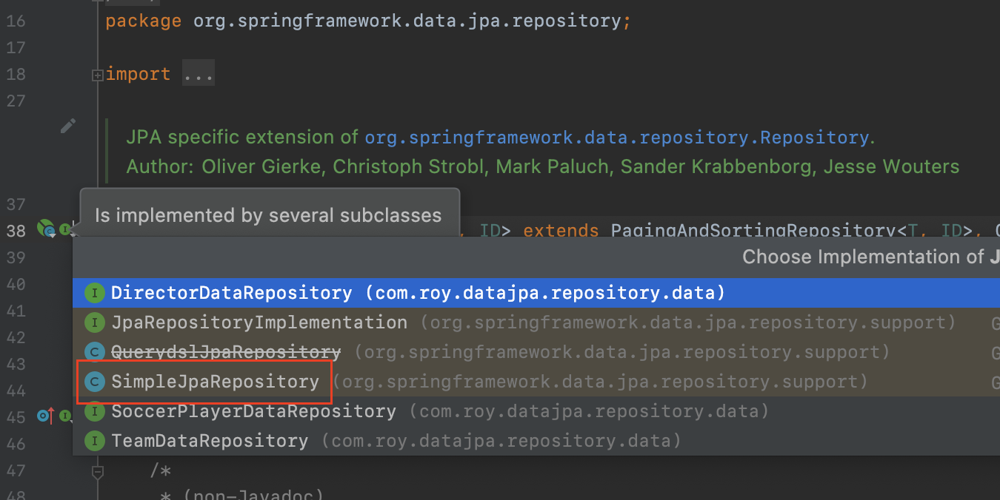

이번 장에서는 Spring Data JPA 구현체에 대해서 알아본다.
글의 하단부에 참고한 강의와 공식문서의 경로를 첨부하였으므로 자세한 사항은 강의나 공식문서에서 확인한다.
모든 코드는 [깃허브 (링크)](https://github.com/roy-zz/data-jpa)에 있다.

---

테스트를 진행하기 위해서 Director라는 Entity 클래스를 생성하였다.

```java
@Entity
@EntityListeners(AuditingEntityListener.class)
public class Director {
    @Id @GeneratedValue
    private Long id;
    private String name;
    @CreatedDate
    private LocalDateTime createdAt;
}
```

Director Entity를 다루는 Repository를 생성한다.

```java
public interface DirectorDataRepository extends JpaRepository<Director, Long> {}
```

우리는 인터페이스만 생성하였고 구현체는 Spring Data JPA에서 생성한다.
구현체가 어떻게 작성되어 있는지 확인하기 위해 JpaRepository 인터페이스로 이동한다.

JpaRepository에서 Choose Implementation of JpaRepository를 확인해보면 SimpleJpaRepository가 있는 것을 확인할 수 있다.



---

먼저 확인해야하는 부분은 클래스 레벨의 어노테이션이다.
우리가 선언한 인터페이스의 구현체가 @Repository 어노테이션을 사용하고 있기 때문에 인터페이스를 생성하는 것 만으로도 Component Scan의 대상이 되어 Bean으로 등록되어 진다.
또한 JPA에서 데이터 생성 및 수정은 모두 Transaction 내에서 이루어져야하는데 내부적으로 Transactional 어노테이션을 사용하고 있다.


```java
@Repository
@Transactional(readOnly = true)
public class SimpleJpaRepository<T, ID> implements JpaRepositoryImplementation<T, ID> {

    private static final String ID_MUST_NOT_BE_NULL = "The given id must not be null!";
    // 이하 생략
}
```

몇 개의 메서드만 확인해보도록 한다.

Count의 경우 우리가 순수 JPA 기반으로 전체 데이터의 수를 가져오는 방법과 동일하게 작성되어 있다.

**count()**

```java
@Repository
@Transactional(readOnly = true)
public class SimpleJpaRepository<T, ID> implements JpaRepositoryImplementation<T, ID> {

    private static final String ID_MUST_NOT_BE_NULL = "The given id must not be null!";

    private final JpaEntityInformation<T, ?> entityInformation;
    private final EntityManager em;
    // 생략...
	@Override
	public long count() {
		return em.createQuery(getCountQueryString(), Long.class).getSingleResult();
	}
    // 생략...
    private String getCountQueryString() {

        String countQuery = String.format(COUNT_QUERY_STRING, provider.getCountQueryPlaceholder(), "%s");
        return getQueryString(countQuery, entityInformation.getEntityName());
    }
}

public abstract class QueryUtils {
    public static final String COUNT_QUERY_STRING = "select count(%s) from %s x";
}
```

Delete의 경우 삭제 요청을 받은 Entity가 정말 존재하는 Entity인지 확인한다.
이후 이미 영속 상태라면 바로 엔티티 매니저의 remove를 호출하고 준영속 상태라면 엔티티 매니저에 merge하여 영속 상태로 만들고 remove를 호출하여 제거한다.

**delete()**

```java
@Repository
@Transactional(readOnly = true)
public class SimpleJpaRepository<T, ID> implements JpaRepositoryImplementation<T, ID> {

    private static final String ID_MUST_NOT_BE_NULL = "The given id must not be null!";

    private final JpaEntityInformation<T, ?> entityInformation;
    private final EntityManager em;
    // 생략
	@Override
	@Transactional
	@SuppressWarnings("unchecked")
	public void delete(T entity) {

		Assert.notNull(entity, "Entity must not be null!");

		if (entityInformation.isNew(entity)) {
			return;
		}

		Class<?> type = ProxyUtils.getUserClass(entity);

		T existing = (T) em.find(type, entityInformation.getId(entity));

		// if the entity to be deleted doesn't exist, delete is a NOOP
		if (existing == null) {
			return;
		}

		em.remove(em.contains(entity) ? entity : em.merge(entity));
	}
    // 생략
}
```

결국 Spring Data JPA도 우리가 순수 JPA를 사용하는 것과 다를 것 없이 필요한 기능들을 모두 만들어 두었을 뿐이다.

---

### Transaction

일반적으로 Service Layer에서 @Transaction 어노테이션을 사용하고 Repository Layer를 호출하게 된다.
SimpleJpaRepository는 @Transactional의 기본 전파 속성(propagation)인 REQUIRED를 사용하고 있으므로 Service Layer의 트랜잭션 하나에 합쳐지게 된다.

Service에서 Entity를 생성하여 저장하고 수정하는 작업을 진행한다고 가정해본다.
만약 Service에 트랜잭션이 없다면 저장과 수정은 서로 다른 트랜잭션에서 처리가 될 것이다.

우리가 원하는 상황이 Entity를 저장하고 수정하는 단계에서 문제가 발생하면 저장된 Entity를 삭제해야 하는 상황이라면
하나의 트랜잭션으로 묶여있지 않기 때문에 우리가 원하는 대로 작동하지 않을 것이다.

만약 Service Layer에서 이루어지는 작업이 하나의 트랜잭션으로 묶여야한다면
Repository Layer의 트랜잭션과는 별개로 Service Layer에도 @Transactional 어노테이션을 사용하여 하나의 트랜잭션으로 묶어주어야 한다.

---

참고한 강의:

- https://www.inflearn.com/course/%EC%8A%A4%ED%94%84%EB%A7%81-%EB%8D%B0%EC%9D%B4%ED%84%B0-JPA-%EC%8B%A4%EC%A0%84
- https://www.inflearn.com/course/%EC%8A%A4%ED%94%84%EB%A7%81%EB%B6%80%ED%8A%B8-JPA-API%EA%B0%9C%EB%B0%9C-%EC%84%B1%EB%8A%A5%EC%B5%9C%EC%A0%81%ED%99%94
- https://www.inflearn.com/course/%EC%8A%A4%ED%94%84%EB%A7%81%EB%B6%80%ED%8A%B8-JPA-%ED%99%9C%EC%9A%A9-1
- https://www.inflearn.com/course/ORM-JPA-Basic

JPA 공식 문서:

- https://docs.spring.io/spring-data/jpa/docs/current/reference/html/#reference

위키백과:

- https://ko.wikipedia.org/wiki/%EC%9E%90%EB%B0%94_%ED%8D%BC%EC%8B%9C%EC%8A%A4%ED%84%B4%EC%8A%A4_API