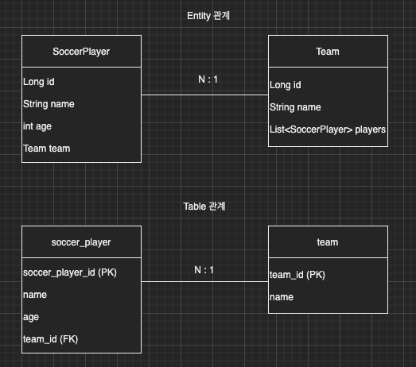

이번 장에서는 Spring Data JPA의 기능을 살펴보기 전에 무엇인지 간략하게 알아보도록 한다.
글의 하단부에 참고한 강의와 공식문서의 경로를 첨부하였으므로 자세한 사항은 강의나 공식문서에서 확인한다.

---

스프링 부트와 일반 JPA를 사용하면서 개발 생산성을 많이 높여왔다.
하지만 여기에 스프링 데이터 JPA까지 사용하게 되면 더욱 개발 생산성이 높아진다.

이번 장에서는 축구선수(SoccerPlayer)와 선수들이 속해있는 팀(Team)을 가지고 예를 들어본다.



**SoccerPlayer**

```java
@Entity
@Getter @Setter
@ToString(of = {"id", "name", "age"})
@NoArgsConstructor(access = PROTECTED)
public class SoccerPlayer {

    @Id @GeneratedValue
    @Column(name = "soccer_player_id")
    private Long id;
    private String name;
    private int age;

    @ManyToOne(fetch = FetchType.LAZY)
    @JoinColumn(name = "team_id")
    private Team team;

    public SoccerPlayer(String name) {
        this(name, 0);
    }

    public SoccerPlayer(String name, int age) {
        this(name, age, null);
    }

    public SoccerPlayer(String name, int age, Team team) {
        this.name = name;
        this.age = age;
        if (Objects.nonNull(team)) {
            changeTeam(team);
        }
    }

    public void changeTeam(Team team) {
        this.team = team;
        team.getSoccerPlayers().add(this);
    }

}
```

**Team**

```java
@Entity
@Getter @Setter
@ToString(of = {"id", "name"})
@NoArgsConstructor(access = PROTECTED)
public class Team {

    @Id @GeneratedValue
    @Column(name = "team_id")
    private Long id;
    private String name;

    @OneToMany(mappedBy = "team")
    private List<SoccerPlayer> soccerPlayers = new ArrayList<>();

    public Team(String name) {
        this.name = name;
    }

}
```

---

### 

---

참고한 강의:

- https://www.inflearn.com/course/%EC%8A%A4%ED%94%84%EB%A7%81-%EB%8D%B0%EC%9D%B4%ED%84%B0-JPA-%EC%8B%A4%EC%A0%84
- https://www.inflearn.com/course/%EC%8A%A4%ED%94%84%EB%A7%81%EB%B6%80%ED%8A%B8-JPA-API%EA%B0%9C%EB%B0%9C-%EC%84%B1%EB%8A%A5%EC%B5%9C%EC%A0%81%ED%99%94
- https://www.inflearn.com/course/%EC%8A%A4%ED%94%84%EB%A7%81%EB%B6%80%ED%8A%B8-JPA-%ED%99%9C%EC%9A%A9-1
- https://www.inflearn.com/course/ORM-JPA-Basic

JPA 공식 문서: 

- https://docs.spring.io/spring-data/jpa/docs/current/reference/html/#reference

위키백과: 

- https://ko.wikipedia.org/wiki/%EC%9E%90%EB%B0%94_%ED%8D%BC%EC%8B%9C%EC%8A%A4%ED%84%B4%EC%8A%A4_API