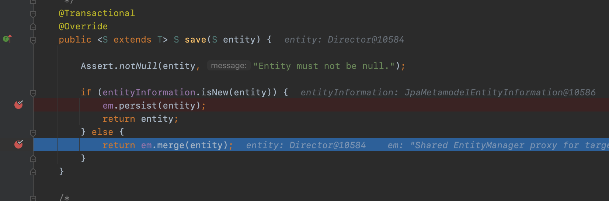

이번 장에서는 Entity가 새로운 Entity인지 존재하는 Entity인지 구분하는 방법에 대해서 알아본다.
글의 하단부에 참고한 강의와 공식문서의 경로를 첨부하였으므로 자세한 사항은 강의나 공식문서에서 확인한다.
모든 코드는 [깃허브 (링크)](https://github.com/roy-zz/data-jpa)에 있다.

---

**SimpleJpaRepository**의 save() 메서드를 보면 EntityInformation의 isNew()를 호출하여 새로운 엔티티인지 확인하고 있다.
isNew의 내용을 확인하기 위해 타고 들어가보면 EntityInformation은 인터페이스이며 이를 구현하는 5개의 클래스가 있는 것을 확인할 수 있다.


우리가 어떠한 구현체를 사용하는지 알아보기 위해 데이터를 저장하는 시점을 디버거로 걸어서 EntityInformation의 정체를 확인해본다.


JpaMetamodelEntityInformation인 것을 확인할 수 있다.  
이제 구현체의 isNew() 메서드를 확인해본다.

```java
public class JpaMetamodelEntityInformation<T, ID> extends JpaEntityInformationSupport<T, ID> {
    
    private final IdMetadata<T> idMetadata;
    private final Optional<SingularAttribute<? super T, ?>> versionAttribute;
    private final Metamodel metamodel;
    private final @Nullable String entityName;
    // 생략
    @Override
    public boolean isNew(T entity) {

        if (!versionAttribute.isPresent()
                || versionAttribute.map(Attribute::getJavaType).map(Class::isPrimitive).orElse(false)) {
            return super.isNew(entity);
        }

        BeanWrapper wrapper = new DirectFieldAccessFallbackBeanWrapper(entity);

        return versionAttribute.map(it -> wrapper.getPropertyValue(it.getName()) == null).orElse(true);
    }
}
```

JpaEntityInformation을 상속받고 있으며 슈퍼클래스의 isNew()를 사용하고 있다.
이번에는 JpaEntityInformationSupport의 isNew()를 확인해본다.

```java
public abstract class AbstractEntityInformation<T, ID> implements EntityInformation<T, ID> {
	public boolean isNew(T entity) {

		ID id = getId(entity);
		Class<ID> idType = getIdType();

		if (!idType.isPrimitive()) {
			return id == null;
		}

		if (id instanceof Number) {
			return ((Number) id).longValue() == 0L;
		}

		throw new IllegalArgumentException(String.format("Unsupported primitive id type %s!", idType));
	}
}
```

Id의 타입이 Primitive 타입이라면 null인 경우를 새로운 Entity라고 판단을 하고 Primitive 타입이 아니라면(객체라면) 0L인 경우를 새로운 Entity라고 판단을 한다.

테스트를 진행하던 Director 클래스의 Id가 String으로 변환되고 @GeneratedValue를 통해 생성되는 것이 아니라
어플리케이션 레벨에서 Entity가 생성될 때 Id값이 지정된다면 어떻게 될까.

String인 Id값은 Entity가 저장되는 시점이 아닌 만들어지는 시점에 생성되기 때문에 isNew()로직에 의해 이미 DB에 존재하는 Entity로 판단된다.
이러한 경우 save되는 시점에 persist가 아닌 merge를 호출하게 된다.

정말로 merge를 호출하게 되는지 확인해본다.
테스트를 위해 변경된 클래스의 정보는 아래와 같다.

**Director**

```java
@Entity
@NoArgsConstructor(access = PROTECTED)
@EntityListeners(AuditingEntityListener.class)
public class Director {

    @Id
    private String id;
    private String name;
    @CreatedDate
    private LocalDateTime createdAt;

    public Director(String id, String name) {
        this.id = id;
        this.name = name;
    }

}
```

**DirectorDataRepositoryTest**

```java
@SpringBootTest
class DirectorDataRepositoryTest {

    @Autowired
    private DirectorDataRepository dataRepository;

    @Test
    @Rollback(value = false)
    @DisplayName("감독 저장 테스트")
    void saveDirectorTest() {
        Director director = new Director("AID", "Roy");
        dataRepository.save(director);
    }

}
```

테스트 코드에서 Id값이 있는 Entity를 생성하였고 리포지토리의 save를 호출하였다.

테스트 결과 entityManager의 merge를 호출하는 것을 확인할 수 있다.



---

### Persist vs Merge

Persist와 Merge는 [이전에 작성한 글(링크)](https://imprint.tistory.com/126)에 자세하게 다루었다.
간략하게 Persist는 새로운 엔티티라고 판단하고 DB에 저장하는 행위이고 Merge는 이미 존재하는 엔티티라고 판단하고 이전 데이터에 새로운 엔티티의 정보를 채워넣는다.
이러한 과정에서 DB의 데이터를 조회하기 위해 한 번의 Select 쿼리가 발생된다.

한 번의 Insert 쿼리로 끝날 수 있는 로직이 Select -> 비교 및 변경 -> Insert로 변경되어 성능을 악화시키게 된다.

이러한 문제를 해결하기 위한 방법으로 Entity가 Persistable의 구현체가 되어 isNew()를 직접 구현하게 할 수 있다.

변경된 Director 클래스는 아래와 같다.

```java
@Entity
@NoArgsConstructor(access = PROTECTED)
@EntityListeners(AuditingEntityListener.class)
public class Director implements Persistable<String> {
    @Id
    private String id;
    private String name;
    @CreatedDate
    private LocalDateTime createdAt;

    public Director(String id, String name) {
        this.id = id;
        this.name = name;
    }

    @Override
    public String getId() {
        return this.name;
    }

    @Override
    public boolean isNew() {
        return Objects.isNull(createdAt);
    }
}
```

createdAt은 @GeneratedValue와 같이 Entity가 DB에 Insert될 때 생성되는 값이다.
isNew() 오버라이딩 하여 createdAt의 null 유무로 새로운 엔티티인지 확인하도록 하였다.

변경하고 merge가 아닌 persist를 호출하는지 확인해본다.


우리가 원하는대로 persist를 호출하는 것을 알 수 있다.

---

참고한 강의:

- https://www.inflearn.com/course/%EC%8A%A4%ED%94%84%EB%A7%81-%EB%8D%B0%EC%9D%B4%ED%84%B0-JPA-%EC%8B%A4%EC%A0%84
- https://www.inflearn.com/course/%EC%8A%A4%ED%94%84%EB%A7%81%EB%B6%80%ED%8A%B8-JPA-API%EA%B0%9C%EB%B0%9C-%EC%84%B1%EB%8A%A5%EC%B5%9C%EC%A0%81%ED%99%94
- https://www.inflearn.com/course/%EC%8A%A4%ED%94%84%EB%A7%81%EB%B6%80%ED%8A%B8-JPA-%ED%99%9C%EC%9A%A9-1
- https://www.inflearn.com/course/ORM-JPA-Basic

JPA 공식 문서:

- https://docs.spring.io/spring-data/jpa/docs/current/reference/html/#reference

위키백과:

- https://ko.wikipedia.org/wiki/%EC%9E%90%EB%B0%94_%ED%8D%BC%EC%8B%9C%EC%8A%A4%ED%84%B4%EC%8A%A4_API