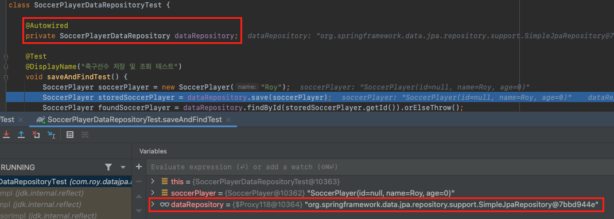
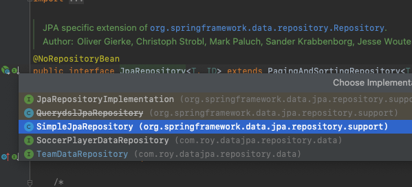
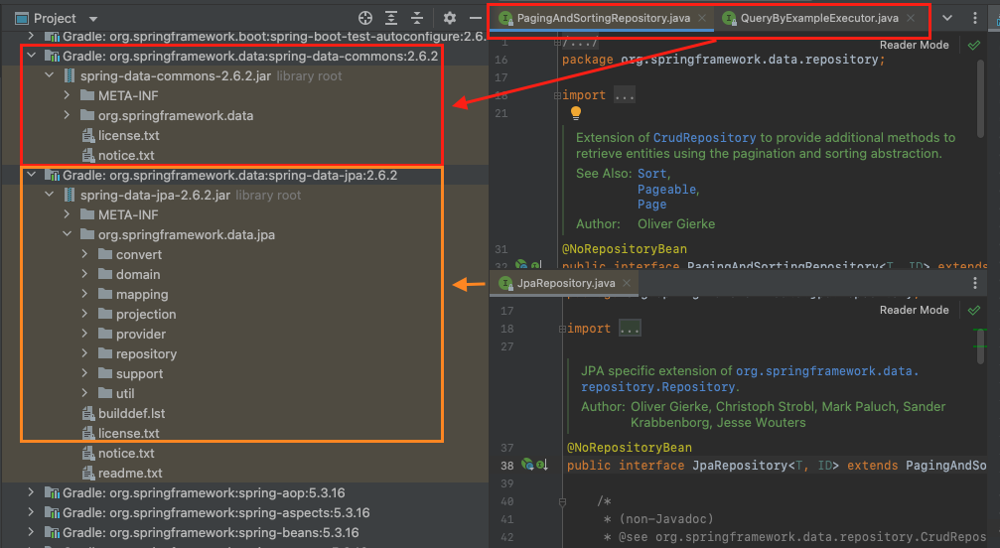
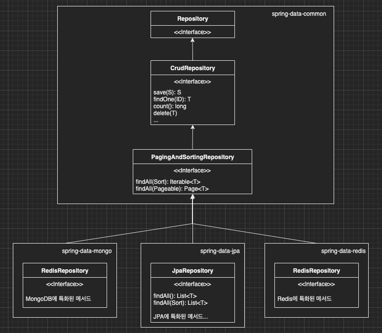

이번 장에서는 [Spring Data API 개요 (링크)](https://imprint.tistory.com/132)에 이어 Spring Data JPA가 어떠한 방식으로 작동하는지 알아보도록 한다.
글의 하단부에 참고한 강의와 공식문서의 경로를 첨부하였으므로 자세한 사항은 강의나 공식문서에서 확인한다.

---

우리는 이전 장에서 아래처럼 리포지토리 인터페이스를 만드는 것 만으로 기본적인 CRUD가 작동하는 것을 확인하였다.

**SoccerPlayerDataRepository**

```java
public interface SoccerPlayerDataRepository extends JpaRepository<SoccerPlayer, Long> {}
```

**TeamDataRepository**

```java
public interface TeamDataRepository extends JpaRepository<Team, Long> {}
```

당연히 인터페이스만으로 동작하는 서비스는 없다.
우리는 구현체를 만든적이 없으니 누군가 구현체를 만들어주었다는 건데 구현체를 확인해본다.

테스트 코드의 아무 곳이나 break를 걸어놓고 우리가 선언한 인터페이스의 구현체가 무엇인지 확인해본다. 



org.springframework.data.jpa.repository.support의 SimpleJpaRepository 클래스의 객체인 것을 확인할 수 있다.
우리의 리포지토리가 상속받고 있는 JpaRepository로 타고 올라가서 JpaRepository를 구현하고 있는 클래스를 확인해보면 SimpleJpaRepository가 있는 것을 확인 할 수 있다.



SimpleJpaRepository는 제네릭으로 타입이 정해지도록 구현되어 있다.
T는 엔티티를 의미하며, ID는 엔티티의 식별자를 의미한다. 또한 S는 엔티티와 그 자식 타입을 의미한다.
이렇게 생성되는 시점에 자신에게 맞는 엔티티가 결정되기 때문에 우리가 새로 생성하는 엔티티에 대한 기능이 정상적으로 작동하는 것이다.

예를 들어 ~ extends JpaRepository<SoccerPlayer, Long> 로 적는다면
이 리포지토리는 SoccerPlayer에 대한 기본적인 CRUD를 제공하며 해당 엔티티의 id는 Long임을 Spring Data JPA에게 가르쳐주는 것이다.

```java
@Repository
@Transactional(readOnly = true)
public class SimpleJpaRepository<T, ID> implements JpaRepositoryImplementation<T, ID> {
    
    // 이전 생략
    
	@Override
	public Optional<T> findById(ID id) {

		Assert.notNull(id, ID_MUST_NOT_BE_NULL);

		Class<T> domainType = getDomainClass();

		if (metadata == null) {
			return Optional.ofNullable(em.find(domainType, id));
		}

		LockModeType type = metadata.getLockModeType();

		Map<String, Object> hints = new HashMap<>();
		getQueryHints().withFetchGraphs(em).forEach(hints::put);

		return Optional.ofNullable(type == null ? em.find(domainType, id, hints) : em.find(domainType, id, type, hints));
	}
    
    // 이하 생략
    
}
```

주요 메서드는 아래와 같다.

- save(S): 새로운 엔티티(id가 없는)는 저장하고 이미 존재하는 엔티티(id가 있는)는 병합한다.
- delete(T): 엔티티를 삭제한다. (EntityManager.remove())
- findById(ID): 단일 엔티티를 Optional 타입으로 조회한다. (EntityManager.find())
- getOne(ID): 엔티티를 프록시로 조회하여 사용하는 시점에 초기화한다. (EntityManager.getReference())
- findAll(): 모든 엔티티를 조회하며 Sort, Pageable을 적용할 수 있다.

---

### Spring Data JPA 구조

우리가 사용하는 JpaRepository는 spring-data-jpa 라이브러리에 있다.
JpaRepository는 PagingAndSortingRepository를 상속받고 있다.
여기서 중요한 점은 PagingAndSortingRepository는 spring-data-commons 라이브러리에 존재한다.



PagingAndSortingRepository는 data-jpa, data-mongo, data-redis에서 모두 사용할 수 있도록 추상화되어 있다는 의미가 된다.
정리하면 DB의 타입(RDBMS, NoSQL)에 종속적이지 않은 기능은 모두 spring-data-commons에 추상화되어 있고
DB의 타입에 종속적인 기능(예를 들어 Transaction)들은 각각의 data-* 라이브러리에 존재한다는 의미가 된다.

그림을 그려보면 아래와 같다.




---

참고한 강의:

- https://www.inflearn.com/course/%EC%8A%A4%ED%94%84%EB%A7%81-%EB%8D%B0%EC%9D%B4%ED%84%B0-JPA-%EC%8B%A4%EC%A0%84
- https://www.inflearn.com/course/%EC%8A%A4%ED%94%84%EB%A7%81%EB%B6%80%ED%8A%B8-JPA-API%EA%B0%9C%EB%B0%9C-%EC%84%B1%EB%8A%A5%EC%B5%9C%EC%A0%81%ED%99%94
- https://www.inflearn.com/course/%EC%8A%A4%ED%94%84%EB%A7%81%EB%B6%80%ED%8A%B8-JPA-%ED%99%9C%EC%9A%A9-1
- https://www.inflearn.com/course/ORM-JPA-Basic

JPA 공식 문서:

- https://docs.spring.io/spring-data/jpa/docs/current/reference/html/#reference

위키백과:

- https://ko.wikipedia.org/wiki/%EC%9E%90%EB%B0%94_%ED%8D%BC%EC%8B%9C%EC%8A%A4%ED%84%B4%EC%8A%A4_API